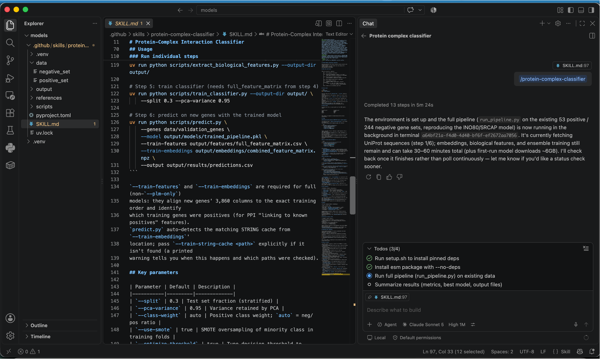

# Protein-Complex Interaction Classifier 

A VS Code / Copilot **agent skill** that predicts whether proteins interact with
a target protein complex (e.g. the INO80/SRCAP chromatin remodeling complexes)
starting from plain gene symbol lists.

## What this skill does

Given a list of known interactors (positives) and non-interactors (negatives),
it fetches sequences from UniProt, generates protein language model (PLM)
embeddings, extracts biological features, builds a combined feature matrix, and
trains an ensemble ML classifier — then predicts on new, unlabeled gene lists.

```
Gene lists (positive + negative)
    │
    ├─▶ 1. Fetch sequences from UniProt
    │
    ├─▶ 2. Generate PLM embeddings (4 models → 3,712 dims)
    │       ESM-C 600M · ProtT5-XL · ProteomeLM-S · ProteinBERT
    │
    ├─▶ 3. Extract biological features (148 dims)
    │       physicochemical · composition · domains · GO · PPI
    │
    ├─▶ 4. Build combined feature matrix (3,860 dims)
    │
    ├─▶ 5. Train ensemble classifier
    │       PCA(95%) + SMOTE + class_weight + threshold optimization
    │       9 models: RF, GBM, SVM, LogReg, ExtraTrees, MLP,
    │                 Soft Voting, Stacking, Balanced Bagging
    │
    └─▶ 6. Predict on new (unlabeled) gene lists
```

On the reference INO80/SRCAP dataset (53 positives / 244 negatives, 297 total),
the winning model is **Stacking (LR meta)** at F1 = 0.897, Precision = 1.000,
Recall = 0.812 (threshold = 0.28).

## Repository layout (tree view)

```
protein-complex-classifier/
├── SKILL.md                          # skill definition + frontmatter (drives agent invocation)
├── README.md                         # this file
├── pyproject.toml / uv.lock          # pinned dependencies (reproducible env)
├── data/
│   ├── positive_set                  # 53 known interactors (gene symbols)
│   ├── negative_set                  # 244 non-interactors (gene symbols)
│   ├── embeddings/
│   │   └── combined_feature_matrix.npz   # 297 x 3,712 PLM embeddings
│   ├── features/
│   │   ├── full_feature_matrix.npz       # 297 x 3,860 full matrix (PLM + bio)
│   │   ├── full_feature_matrix.csv       # same, human-readable
│   │   └── _string_cache.json            # training-time STRING partners cache
│   └── models/
│       └── trained_pipeline.pkl          # the deployed classifier
├── scripts/
│   ├── setup.sh                      # install pinned dependencies
│   ├── generate_embeddings.py        # steps 1–2: sequences + PLM embeddings
│   ├── extract_biological_features.py# steps 3–4: bio features + combined matrix
│   ├── train_classifier.py           # step 5: train/evaluate 9-model ensemble
│   ├── predict.py                    # step 6: predict on new gene lists
│   ├── run_pipeline.py               # runs all steps end to end
│   └── pipeline_lib.py               # shared helpers (fetching, features, embeddings)
└── references/
    ├── dependencies.md               # dependency pinning rationale
    ├── methodology.md                # design decisions from the case study
    └── models.md                     # embedding models + classifier details
```

## Visualization of the skill trigger in the chat window

