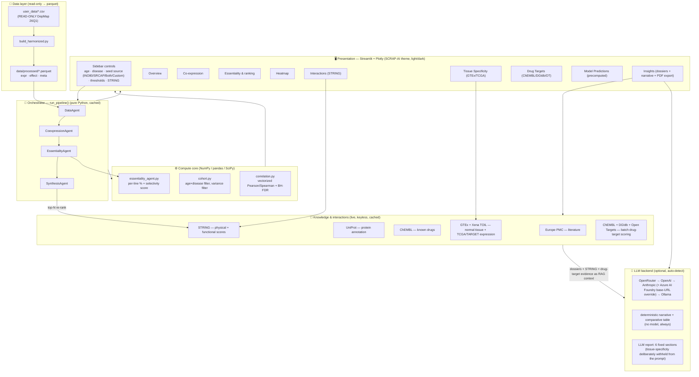
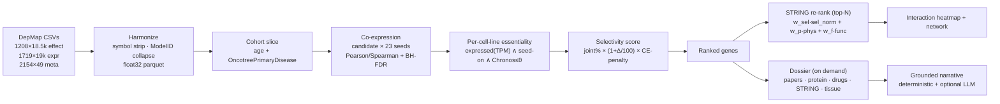

# SCRAP-AI — Winning Tech Stack & Architecture

**SCRAP-AI** — *Selective Cancer-dependency Ranking of Associated Proteins.*

A local-first, reproducible, multi-agent Streamlit app that ranks genes
**co-expressed with the INO80/SRCAP chromatin-remodeling complex** by their
**cohort-selective essentiality**, folds in **STRING physical/functional
interaction** and **GTEx/TCGA tissue-specificity** evidence, and builds grounded **target dossiers** (literature +
protein/drug annotations) for candidate genes.

---

## 1. Layered architecture



---

## 2. Data & analysis flow (one run)



**Evidence stack per candidate:** co-expression → cohort-selective essentiality →
**STRING physical/functional** → literature + drug annotations → (on-demand) **GTEx/TCGA
tissue-specificity** evidence.

---

## 3. The tech stack

| Layer | Choice | Why it wins |
|---|---|---|
| **UI** | Streamlit + Plotly, custom SCRAP-AI theme (light/dark) | fully interactive (hover, click-to-drill, selection events), branded, zero JS |
| **Orchestration** | Plain-Python agent pipeline (`run_pipeline`) | deterministic, testable, no hidden LLM in the control path |
| **Agents** | 4 role classes (`Data/Coexpression/Essentiality/Synthesis`) + one `AnalysisContext` | separation of concerns; each independently unit-tested |
| **Compute** | NumPy + pandas + SciPy | vectorized candidate×seed Pearson via BLAS matmul; BH-FDR; matches `scipy`/`statsmodels` to 1e-10 |
| **Data** | read-only CSV → float32 **parquet** (pyarrow) | 440 MB CSV → ~200 MB parquet; sub-second loads; `user_data/` never mutated |
| **Caching** | `@st.cache_data` + `functools.lru_cache` | on-the-fly compute + API lookups stay interactive |
| **Knowledge (RAG)** | Europe PMC + UniProt + ChEMBL via `urllib` | keyless, live, cached; no vector DB needed for a few genes |
| **Interactions** | STRING REST (functional + physical), keyless | folds into ranking (top-N) + heatmap + network graph |
| **Tissue specificity** | GTEx + UCSC Xena TOIL, keyless, **zero new deps** (hand-reimplemented over `urllib`, not `xenaPython`) | on-demand normal-tissue silence + TCGA pan-cancer + matched tumor cohort, gated + scored (plus a graded fail/low/medium/high tier alongside the strict pass_all AND) |
| **Drug targets** | ChEMBL + DGIdb + Open Targets (+ optional PRISM), one new dep (`requests`) | on-demand batch scoring: known drugs, FDA status, 3-/5-tier cancer relevance |
| **LLM** | provider auto-detect: OpenRouter→OpenAI→Anthropic (+ Azure AI Foundry base-URL override)→**Ollama `llama3.1:8b`** | BYOK; graceful cloud/local fallback; param-drop retry; grounded prompts; structured 6-section report |
| **PDF export** | `fpdf2` (pure Python, no system libraries), one new dep | bounded markdown-subset renderer (`app/pdf_export.py`) for both the deterministic narrative and the LLM report + its comparative table |
| **Config/secrets** | `.env` autoloader + in-UI key field + self-test | three ways to supply a key; `.env` git-ignored |
| **Runtime** | `uv`-managed venv, Python 3.12 | reproducible, isolated; `uv run` everywhere |
| **Tests** | pytest, 136 tests | numerics vs reference libs, agent pipeline, RAG + STRING + Xena/GTEx + ChEMBL/DGIdb/OT APIs + PDF export (network-gated skips) |

---

## 4. Features implemented

**Cohort & seeds**
- Age group (Pediatric default) + Fetus toggle · `OncotreePrimaryDisease` with live cohort sizes
- Seed source: **INO80 / SRCAP / Both / Custom** (de-duplicated union for Both; Custom empties the list for pasting or uploading a `.txt` gene file), editable

**Analysis**
- Co-expression to the seed complex (Pearson/Spearman; cohort or **pan-cancer** population)
- BH-FDR; per-candidate aggregates; seed-exempt variance filter
- **Per-cell-line essentiality**: % co-expressed, % essential, **% joint**, conditional %
- **Selectivity-weighted ranking**: joint% × cohort-vs-pan-cancer Δ × common-essential penalty
- **STRING-weighted re-rank** (top-N): normalized weighted-sum `w_sel·sel_norm + w_phys·physical + w_func·functional` (all ∈ [0,1]; weights auto-normalized; sel_norm = min-max selectivity across top-N)
- Common-essential flag + global show/hide

**Interactive visuals (Plotly)**
- Volcano (click-to-drill scatter per cell line) · % co-expressed vs % essential scatter
- Ranked bar · candidate×seed heatmap (selective genes, score-ordered)
- **Interactions tab**: STRING candidate×seed heatmap + interaction network graph
  (physical/functional toggle, node size = selectivity, edge width = STRING) · CSV export everywhere
- **Tissue Specificity tab** (on-demand, typed genes): GTEx normal-tissue silence gate +
  TCGA pan-cancer low-fraction gate + matched tumor-cohort (TCGA/TARGET) positive gate,
  best-effort tissue/cohort auto-suggestion from the current cancer type (manual override
  always available), configurable thresholds, Plotly heatmap. Also reports a graded
  `fail`/`low`/`medium`/`high` tier (`n_gates_passed`, additive to the strict `pass_all`
  AND) so a gene passing 2/3 gates ranks above one passing 0/3, instead of both being
  lumped into the same "False" bucket. Generalized from a collaborator's
  Neuroblastoma-specific pipeline (`user_data/gtex_other_expression/`); validated to
  reproduce its exact expected result (PHOX2B/MYCN ranked 1–2, all gates pass).
  Fetal/CELLxGENE-Census confirmation layer intentionally **not integrated** (heavy,
  1–2 GB) — remains a standalone script.
- **Drug Targets tab** (on-demand, batch over typed/top-ranked genes): known drugs from
  ChEMBL + DGIdb, FDA status, potency, and 3-tier (cancer-agnostic) or 5-tier
  (cancer-specific, pre-filled from current disease) scoring, + optional PRISM/DepMap
  sensitivity. Ported from a collaborator's pipeline (`user_data/drug_targets/`); its
  flaky per-drug ChEMBL name-lookup was replaced with one Open Targets call per gene
  (verified 4–5× faster, fully reliable, identical scoring — the only place this app
  uses `requests` rather than bare `urllib`).
- **Model Predictions tab**: displays **precomputed** predictions from an external
  protein-language-model classifier, loaded read-only from a fixed CSV export — never
  run live. A gene absent from the export shows **Not generated/cached**, never a
  fabricated guess; probabilities are only comparable within one export (see Notes).

**Insights / target dossiers**
- Type gene(s) → deterministic relevance narrative (always) + optional LLM-generated
  **structured report** (6 fixed sections: Executive Summary, Cohort-Selective Dependency
  Evidence, Protein Complex/STRING Association, Drug-Design & Therapeutic Relevance,
  Literature Evidence, Experimental Validation & Testing Guidelines)
- **Literature** (Europe PMC) · **protein annotation** (UniProt: domains, active/binding sites, PDB) · **known drugs** (ChEMBL + Drug Targets tab) · **STRING** functional/physical · druggability badge
- **Grounded RAG**: dossiers + STRING + drug-target evidence fed to the LLM; cites papers by PMID; distinguishes direct complex member (high physical) vs pathway link; forbids inventing drugs/PDB/PMIDs/tissue names. Tissue-specificity is deliberately **excluded** from the LLM's own prompt (its median-vs-max gate/score nuance is too easy to flatten into an overconfident sentence) — it still reaches the user via a **deterministic Comparative Summary Table** appended after the LLM's text, built the same way regardless of what the model wrote
- **PDF export**: a "\U0001f4c4 Export as PDF" button next to each narrative (deterministic and LLM), rendering the exact displayed content — headings, bold/italic, bullet lists, and the comparative table — to a branded PDF via a small bounded markdown-subset renderer (`app/pdf_export.py`, `fpdf2`)

**Brand & ops**
- **SCRAP-AI** logo (chromatin/helix mark) in header + favicon; light/dark theme toggle
- One-time parquet build · `@st.cache_data` throughout · provider self-test · `.env`/UI/shell key config

---

## 5. Design principles

1. **Deterministic core, optional intelligence** — all science is reproducible pandas/numpy; the LLM only *narrates* grounded facts, never ranks.
2. **Local-first & BYOK** — runs fully offline (deterministic path + Ollama); any cloud key upgrades it transparently.
3. **Read-only source of truth** — `user_data/` is never written; everything derives into `data/processed/`.
4. **Selectivity over saturation** — ranking rewards cohort-specific dependencies, not pan-essential housekeeping.
5. **Multi-source, grounded evidence** — DepMap numbers + STRING interactions + GTEx/TCGA
   tissue data + real PMIDs; every claim traces to a source, tests pin numerics to reference
   libraries and reproduce a collaborator-validated result exactly.
```
