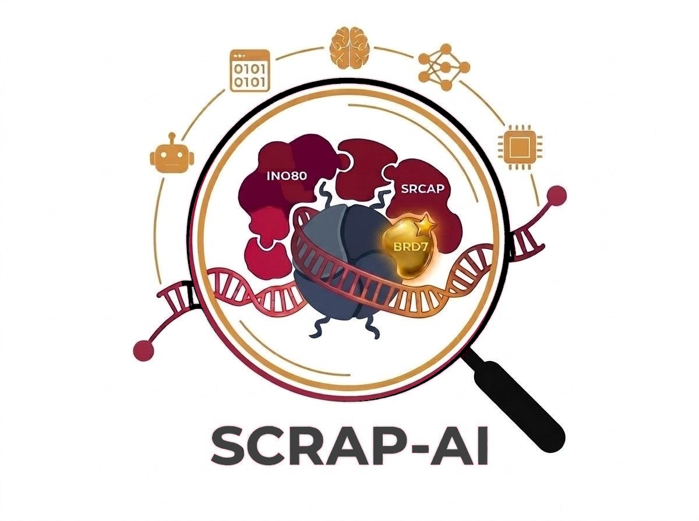

    <h1 align="center"><b><u>Team 1 | Bio Hackathon 2026</u></b></h1>
  <!-- 2. The Title (Centered, Bolded, Underlined) -->
  <h1 align="center"><b>Agentic AI Workflows to Discover Pediatric-Specific INO80/SRCAP Chromatin Remodeler Subunits and Adaptors for Cancer Dependencies</b></h1>
  <!-- 3. The Tagline -->
  <h3 align="center"><b><u>AI</b></u> assisted <b><u>S</b></u>elective <b><u>C</b></u>ancer-dependency <b><u>R</b></u>anking of <b><u>A</b></u>ssociated <b><u>P</b></u>roteins</h3>

  
   

## Team members

- Pandurang Kolekar (Co-Lead)
- Vinesh Vinayachandran (Co-Lead)
- Satish Sati
- Abhinandita Dash
- Sheetal Bhatara
- Yuyu Zhang
- Sreerag M
- Vishakan Deivanayagam
- Dhanus Chinnakalipatti Thilagaa Ramesh
- Nithish Marimuthu

## About

Each human cell packs roughly two meters of DNA into a nucleus only a few micrometers wide, wrapping the genome around histone proteins into nucleosomes — the repeating beads-on-a-string units of chromatin. That packaging is far from static: ATP-dependent chromatin remodelers like INO80 and SRCAP continuously reposition nucleosomes and swap in the histone variant H2A.Z at gene promoters, deciding which genes a cell can even reach. These remodelers are universal — every cell depends on them, which is exactly why their core catalytic machinery is essentially undruggable. But both complexes are modular, built from swappable accessory subunits, and a specific subset of these appears to be one that pediatric tumors are quietly addicted to while healthy cells barely need them — a pediatric-specific weak spot hidden inside a universal machine. This matters because most childhood cancers carry few DNA mutations at all; their vulnerabilities are written into chromatin state, not sequence. Pinpointing these cancer-specific accessory submodules opens the door to disabling a tumor's remodeling machinery while leaving the essential core untouched in healthy tissue — precisely the kind of once-undruggable target that modern degraders like PROTACs and molecular glues can now reach, pointing toward safer, more selective treatments for children with catastrophic cancers.

